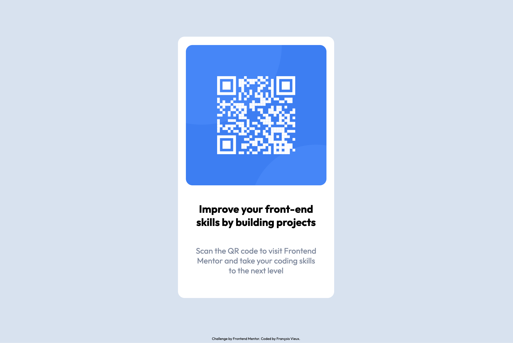

# Frontend Mentor - QR code component solution

This is a solution to the [QR code component challenge on Frontend Mentor](https://www.frontendmentor.io/challenges/qr-code-component-iux_sIO_H). Frontend Mentor challenges help you improve your coding skills by building realistic projects. 

## Table of contents

- [Overview](#overview)
  - [Screenshot](#screenshot)
  - [Links](#links)
- [My process](#my-process)
  - [Built with](#built-with)
  - [What I learned](#what-i-learned)
  - [Continued development](#continued-development)
  - [Useful resources](#useful-resources)
- [Author](#author)
- [Acknowledgments](#acknowledgments)

## Overview

### Screenshot

### Links

- Solution URL: [Frontend_Mentor_QR_code_component](https://francoisgvieux.github.io/Frontend_Mentor_QR_code_component/)

## My process

### Built with

- Semantic HTML5 markup
- CSS custom properties
- Flexbox
- CSS Grid
- Mobile-first workflow

### What I learned

This exercise was a great way to work on my basic HTML and CSS skills. 
I was able to use Flexbox and Grid witch are some of the best tools at our disposal to create responsive websites. 

### Continued development

I would like to add an animation to reduce the size of the QR code when the user does not hover over it.

### Useful resources

- Flexbox - [A Complete Guide to Flexbox](https://css-tricks.com/snippets/css/a-guide-to-flexbox/)
- Grid - [A Complete Guide to Grid](https://css-tricks.com/snippets/css/complete-guide-grid/)

## Author

- Website - [François Vieux](https://www.francoisvieux.com)
- Frontend Mentor - [@yourusername](https://www.frontendmentor.io/profile/francoisgvieux)

## Acknowledgments

Thanks to Chris Coyier for is really useful documentation.
